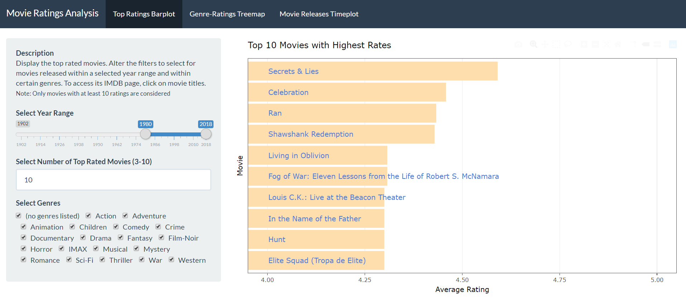
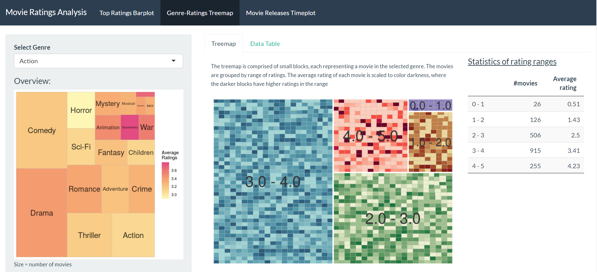
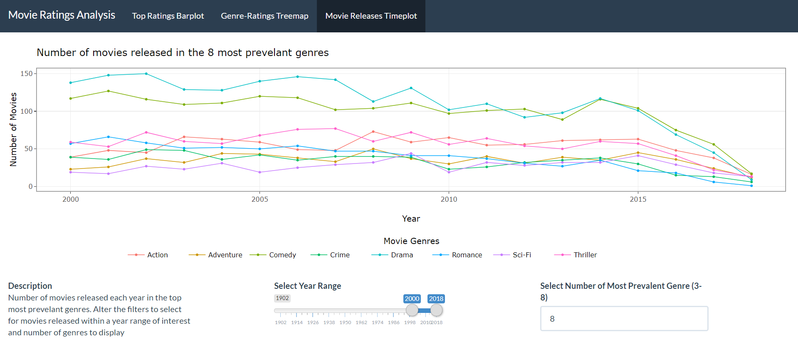

# Movies Vis Project

In this project three visualizations are created from the [MovieLens Dataset](https://grouplens.org/datasets/movielens/latest/). The visualizations are created using Shiny App in R. The complete product is accessible [here](https://sylvai19.shinyapps.io/movies_vis_shiny/). 

## Movies with top ratings

## Number of movies VS ratings in each genre

## Timeline of movies released to the most prevelant genres

### R Package Dependencies

- colorspace
- DT
- forcats
- plotly
- scales
- shiny
- shinythemes
- stringr
- tidyverse
- treemapify

### Citations:

F. Maxwell Harper and Joseph A. Konstan. 2015. The MovieLens Datasets: History and Context. ACM Transactions on Interactive Intelligent Systems (TiiS) 5, 4, Article 19 (December 2015), 19 pages. DOI=http://dx.doi.org/10.1145/2827872
